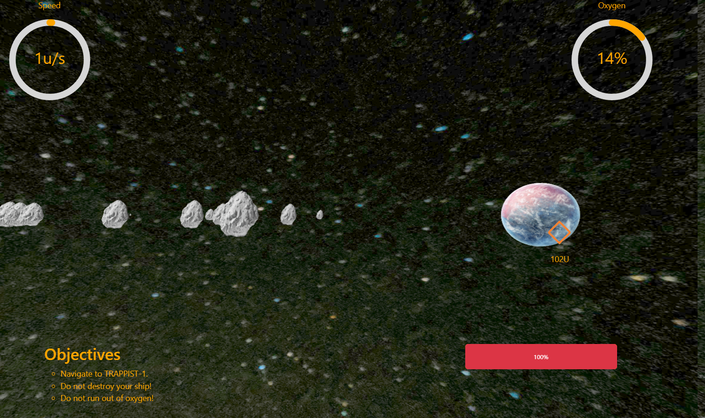
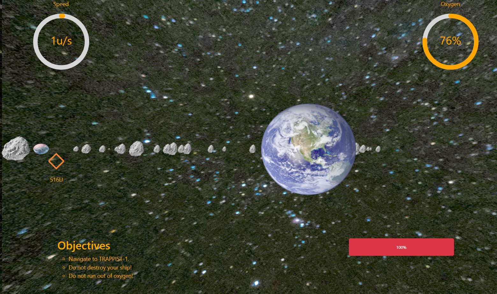
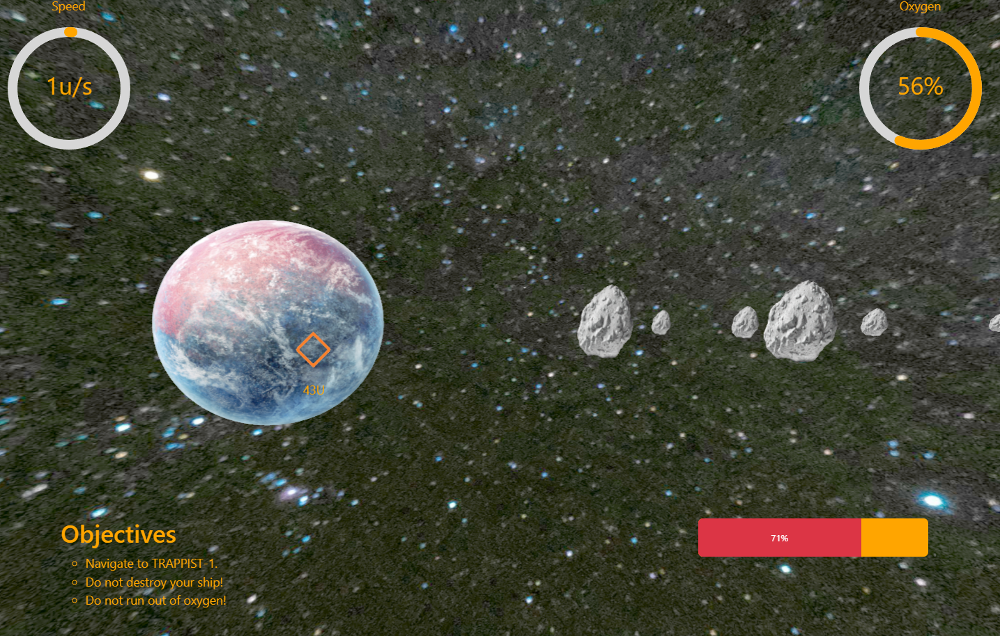
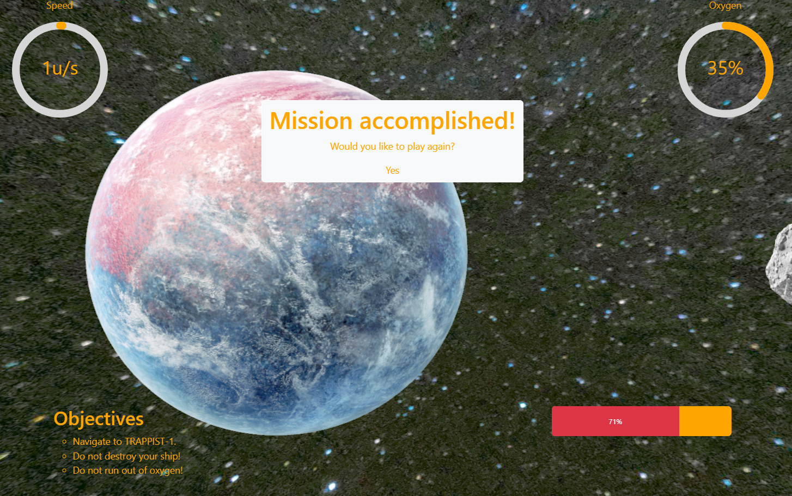

# Starship 58 Adventure

<a href="https://bramtechs.github.io/Starship58Adventure/" target="_blank">Play
in your browser!</a> Use arrow keys to move around.

Original code for a game programmed in 5 hours for
[Hack The Future 2024](https://www.hackthefuture.be/), a Belgian Hackathon.

Developed in a team of two, made in ThreeJS, Boostrap and React.

## Scenario

translated from Dutch

Major Tom and his team are running out of oxygen and need your help to find the
fastest way to 2MASS J23062928-0502285, also known as TRAPPIST-1. You are the
head of the ground control center on Earth and are in charge of using all the
data you receive from the spacecraft. Use this data as best you can to get
everyone safely to their destination before they run out of oxygen. Are you
ready to lead this life-saving mission?

## Screenshots






---

<details>
<summary>Original readme</summary>

# Starship 58 Adventure React TypeScript App

Welcome aboard Starship 58, cadet! This React TypeScript app simulates a journey
through space, challenging you to navigate a rocket through cosmic obstacles to
reach a distant planet.

## Getting Started

### 1. Clone the Repository

Clone the project repository to your local machine using the following commands:

```bash
git clone https://github.com/icapps/react-htf-starship-58-adventure
cd react-htf-starship-58-adventure
git checkout develop
```

### 2. Install Dependencies

Install the required dependencies using Yarn:

```bash
yarn install
```

### 3. Start the Development Server

Start the development server to run the application locally:

```bash
yarn dev
```

### 4. Open the App in Your Browser

Open your browser and navigate to `http://localhost:5173` to see the app
running.

## Project Structure

- **`src/components/`**: Contains all React components.
- **`src/hooks/`**: Custom React hooks.
- **`src/utils/`**: Utility functions and constants.
- **`src/types/`**: TypeScript type definitions.
- **`src/assets/`**: Images and other static assets.
- **`src/contexts/`**: Game state provider.

## Your Mission

As a cadet, your task is to implement the **Command Center** functionality that
will control the rocket's navigation.

### Where to Start

1. **Command Center Component**

   Begin by opening the `CommandCenter` component located at:

   ```
   src/components/CommandCenter/CommandCenter.tsx
   ```

   In this component, you'll find a placeholder where you can build the form
   interface. This form will allow you to input commands to control the rocket's
   direction and rotation.

2. **Understanding the Context**

   The application uses React Context to manage the game state. The
   `GameStateContext` provides access to the game state and functions to update
   it.

   - **Context File**: `src/contexts/GameStateContext.tsx`

   By using the context, you'll be able to:

   - Access the current state of the game, such as the rocket's position and
     oxygen level.
   - Update the rocket's direction and rotation based on user input from your
     form.

3. **Implementing the Form**

   In the `CommandCenter` component, you will need to:

   - Create form elements (e.g., input fields, buttons) that allow users to
     input the rocket's direction and rotation.
   - Use the provided `setDirection` and `setRotation` functions from the
     context to update the rocket's movement based on the user input.
   - Ensure that the inputs are validated and the direction is normalized if
     necessary.

   **Note:** The form has been intentionally left incomplete to provide you with
   the opportunity to build it yourself.

4. **Testing Your Implementation**

   - Use the form you create to control the rocket's movement.
   - Make sure the rocket navigates through space and responds to the commands
     from your form.
   - Monitor the oxygen level and avoid obstacles to successfully reach the
     distant planet.

## Additional Resources

- **React Documentation**:
  [https://reactjs.org/docs/getting-started.html](https://reactjs.org/docs/getting-started.html)
- **TypeScript Documentation**:
  [https://www.typescriptlang.org/docs/](https://www.typescriptlang.org/docs/)
- **Tailwind CSS Documentation**:
  [https://tailwindcss.com/docs](https://tailwindcss.com/docs)
- **React Context API**:
  [https://reactjs.org/docs/context.html](https://reactjs.org/docs/context.html)

## Tips

- **Understand the Game Mechanics**: Familiarize yourself with how the rocket
  moves, how obstacles behave, and how oxygen depletion works.

- **Plan Your Form**: Before coding, plan out what inputs you need (e.g.,
  direction X and Y, rotation angle) and how they will affect the rocket's
  movement.

- **Keep It Simple**: Start with basic functionality and gradually add more
  features or validations as needed.

- **Collaborate and Ask Questions**: If you're working in a team or have mentors
  available, don't hesitate to discuss ideas and ask for guidance.

## Good Luck, Cadet!

Your journey through the stars awaits. Use your skills to navigate the vastness
of space, overcome obstacles, and achieve your mission. May the stars guide you!

</details>
